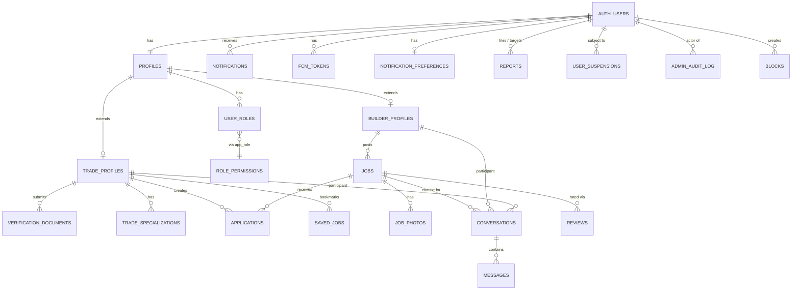

# Jobdun — Database Schema (Supabase)

> **Audience:** You (Ken) deploying to Supabase via `supabase db push`, plus your AI assistant for context.
> **Scope:** Full Phase 0 + Phase 1 (MVP) schema. Phase 2 features (timesheets, quotes, reports, suspensions) included as separate migrations so you can apply them when you build those features.
> **Last updated:** 2026-05-05

---

## 0. Design Principles (read first)

1. **RBAC via Supabase custom-claims auth hook.** A user has ONE role (builder / trade / admin / super_admin / verifier / moderator / support). Role drives a JWT claim. RLS policies use `authorize(permission)` to check.
2. **One profile per user.** `auth.users` (Supabase managed) → `public.profiles` (base) → `public.builder_profiles` OR `public.trade_profiles` (role-specific extension). One-to-zero-or-one.
3. **Soft-delete sensitive entities.** `deleted_at` on jobs, profiles, messages, applications. Hard deletes only via admin tools with audit logging.
4. **Every status field is an enum.** No free-text states.
5. **Every query path has an index.** Listed inline beneath each table.
6. **Every table has RLS enabled.** Default deny. Policies opt in.
7. **PostGIS for location** (geography type, SRID 4326 = lat/lng). Distance queries server-side via `ST_DWithin`.
8. **`pg_trgm` + tsvector for job search.**
9. **`updated_at` trigger** on every mutable table.
10. **Two storage buckets:** `public-media` (avatars, logos, job photos) and `private-docs` (verification docs, signed URLs only).

---

## 1. Deployment Order

Apply migrations in numerical order. Each is idempotent-friendly (uses `if not exists` where it matters).

```bash
# Local dev
supabase start
supabase db reset  # nukes local, re-runs all migrations

# Push to remote
supabase db push

# Generate Dart types after each schema change
supabase gen types dart --schema public > lib/core/supabase/database_types.dart
```

After applying these migrations:

1. Go to **Supabase Dashboard → Authentication → Hooks (Beta)** → enable `custom_access_token_hook`
2. Go to **Authentication → Providers** → enable Email + Apple + Google
3. Go to **Authentication → SMTP Settings** → configure Resend/Postmark
4. Seed an initial super_admin user manually (SQL block at the end)

---

## 2. Migration Files

Create each as a separate file in `supabase/migrations/` with the exact filename shown. The timestamp prefixes establish ordering.

---

### 📄 `supabase/migrations/20260505000001_extensions.sql`

```sql
-- ============================================================================
-- Extensions
-- ============================================================================
-- pgcrypto: gen_random_uuid()
-- citext: case-insensitive emails
-- pg_trgm: fuzzy text search for jobs (trigram similarity)
-- postgis: geography type for location-based queries
-- ============================================================================

create extension if not exists "pgcrypto";
create extension if not exists "citext";
create extension if not exists "pg_trgm";
create extension if not exists "postgis" with schema "extensions";

-- Note: PostGIS lives in `extensions` schema in Supabase, not `public`.
-- Reference geography type as `extensions.geography(point, 4326)` if needed,
-- but Supabase exposes it via search_path so `geography(point, 4326)` works.
```

---

### 📄 `supabase/migrations/20260505000002_enums.sql`

```sql
-- ============================================================================
-- Enums and lookup types
-- ============================================================================
-- All status fields use enums. Adding a value requires a migration.
-- ============================================================================

-- RBAC --------------------------------------------------------------------
create type public.app_role as enum (
  'builder',
  'trade',
  'admin',
  'super_admin',
  'verifier',
  'moderator',
  'support'
);

create type public.app_permission as enum (
  -- Job permissions
  'jobs.create',
  'jobs.update_own',
  'jobs.delete_own',
  'jobs.update_any',
  'jobs.delete_any',
  'jobs.feature',

  -- Application permissions
  'applications.create',
  'applications.update_own',
  'applications.update_any',

  -- Verification permissions
  'verifications.submit',
  'verifications.review',
  'verifications.override',

  -- Moderation permissions
  'reports.view',
  'reports.resolve',
  'users.suspend',
  'users.unsuspend',
  'content.hide',

  -- Admin permissions
  'admin.users.read',
  'admin.users.write',
  'admin.audit.read',
  'admin.flags.write',
  'admin.dashboard.view',

  -- Messaging
  'messages.send',
  'messages.delete_own',
  'messages.read_any'
);

-- Geo --------------------------------------------------------------------
create type public.au_state as enum (
  'NSW', 'VIC', 'QLD', 'WA', 'SA', 'TAS', 'ACT', 'NT'
);

-- Trades --------------------------------------------------------------------
create type public.trade_type as enum (
  'electrician',
  'plumber',
  'carpenter',
  'concreter',
  'painter',
  'tiler',
  'plasterer',
  'roofer',
  'landscaper',
  'bricklayer',
  'glazier',
  'hvac',
  'flooring',
  'demolition',
  'scaffolder',
  'crane_operator',
  'labourer',
  'project_manager',
  'other'
);

-- Verification docs --------------------------------------------------------------------
create type public.doc_type as enum (
  'trade_licence',
  'public_liability',
  'workers_compensation',
  'white_card',
  'photo_id',
  'abn_certificate',
  'other'
);

create type public.verification_status as enum (
  'pending',
  'approved',
  'rejected',
  'expired'
);

-- Jobs --------------------------------------------------------------------
create type public.job_status as enum (
  'draft',
  'open',
  'filled',
  'closed',
  'cancelled'
);

create type public.urgency as enum (
  'standard',
  'urgent'
);

create type public.budget_type as enum (
  'hourly',
  'daily',
  'fixed',
  'negotiable'
);

-- Applications --------------------------------------------------------------------
create type public.application_status as enum (
  'pending',
  'shortlisted',
  'rejected',
  'withdrawn',
  'hired',
  'declined_by_trade'
);

-- Conversations --------------------------------------------------------------------
create type public.conversation_status as enum (
  'active',
  'archived',
  'blocked'
);

-- Notifications --------------------------------------------------------------------
create type public.notification_type as enum (
  'application_received',
  'application_status_changed',
  'new_message',
  'hire_confirmed',
  'hire_declined',
  'verification_approved',
  'verification_rejected',
  'document_expiring',
  'document_expired',
  'review_received',
  'job_filled',
  'system_announcement'
);

create type public.notification_channel as enum (
  'in_app',
  'push',
  'email',
  'sms'
);

-- Reports & moderation (Phase 2) --------------------------------------------------------------------
create type public.report_target as enum (
  'job',
  'message',
  'profile',
  'review',
  'application'
);

create type public.report_reason as enum (
  'scam_or_fraud',
  'fake_credentials',
  'abuse_or_harassment',
  'off_platform_solicitation',
  'spam',
  'inappropriate_content',
  'other'
);

create type public.report_status as enum (
  'open',
  'investigating',
  'resolved',
  'dismissed'
);

create type public.suspension_status as enum (
  'active',
  'lifted',
  'expired'
);
```

---

### 📄 `supabase/migrations/20260505000003_helper_functions.sql`

```sql
-- ============================================================================
-- Helper functions used across migrations
-- ============================================================================

-- updated_at trigger function: applied to every mutable table
create or replace function public.set_updated_at()
returns trigger
language plpgsql
as $$
begin
  new.updated_at = now();
  return new;
end;
$$;

comment on function public.set_updated_at() is
  'Generic updated_at trigger function. Attach to every mutable table.';

-- Validates AU postcode (4 digits)
create or replace function public.is_valid_au_postcode(pc text)
returns boolean
language sql
immutable
as $$
  select pc ~ '^\d{4}$';
$$;

-- Validates AU mobile in +61 format (basic structural check, not carrier validation)
create or replace function public.is_valid_au_mobile(phone text)
returns boolean
language sql
immutable
as $$
  select phone ~ '^\+614\d{8}$';
$$;

-- Validates ABN structure (11 digits, no checksum at MVP)
create or replace function public.is_valid_abn(abn text)
returns boolean
language sql
immutable
as $$
  select abn ~ '^\d{11}$';
$$;
```

---

### 📄 `supabase/migrations/20260505000004_rbac.sql`

```sql
-- ============================================================================
-- RBAC: user_roles, role_permissions, custom access token hook, authorize()
-- Implements pattern from:
-- https://supabase.com/docs/guides/database/postgres/custom-claims-and-role-based-access-control-rbac
-- ============================================================================

-- USER ROLES --------------------------------------------------------------------
create table public.user_roles (
  id        bigint generated by default as identity primary key,
  user_id   uuid references auth.users(id) on delete cascade not null,
  role      public.app_role not null,
  granted_by uuid references auth.users(id) on delete set null,
  granted_at timestamptz not null default now(),
  unique (user_id, role)
);

comment on table public.user_roles is 'Roles assigned to each user. MVP: enforce single-role via app code; relax in Phase 2 if needed.';

-- One-role-per-user constraint (MVP). Drop in Phase 2 if multi-role needed.
create unique index user_roles_one_role_per_user_idx on public.user_roles (user_id);

-- Reverse-lookup index for "who has admin role" queries
create index user_roles_role_idx on public.user_roles (role);

-- ROLE PERMISSIONS --------------------------------------------------------------------
create table public.role_permissions (
  id           bigint generated by default as identity primary key,
  role         public.app_role not null,
  permission   public.app_permission not null,
  unique (role, permission)
);

comment on table public.role_permissions is 'Permissions granted to each role.';

create index role_permissions_role_idx on public.role_permissions (role);

-- AUTH HOOK ---------------------------------------------------------------------
-- Injects user_role claim into JWT on every token issue / refresh.
create or replace function public.custom_access_token_hook(event jsonb)
returns jsonb
language plpgsql
stable
as $$
declare
  claims jsonb;
  user_role public.app_role;
begin
  select role into user_role
  from public.user_roles
  where user_id = (event->>'user_id')::uuid
  limit 1;

  claims := event->'claims';

  if user_role is not null then
    claims := jsonb_set(claims, '{user_role}', to_jsonb(user_role));
  else
    claims := jsonb_set(claims, '{user_role}', 'null');
  end if;

  event := jsonb_set(event, '{claims}', claims);
  return event;
end;
$$;

-- Grants required for the hook to be callable by Supabase Auth
grant usage on schema public to supabase_auth_admin;
grant execute on function public.custom_access_token_hook to supabase_auth_admin;
revoke execute on function public.custom_access_token_hook from authenticated, anon, public;
grant all on table public.user_roles to supabase_auth_admin;
revoke all on table public.user_roles from authenticated, anon, public;

alter table public.user_roles enable row level security;
alter table public.role_permissions enable row level security;

create policy "auth admin reads user_roles"
  on public.user_roles
  as permissive for select
  to supabase_auth_admin
  using (true);

create policy "users read own role"
  on public.user_roles
  for select
  to authenticated
  using (user_id = auth.uid());

create policy "everyone reads role_permissions"
  on public.role_permissions
  for select
  to authenticated
  using (true);

-- AUTHORIZE FUNCTION ----------------------------------------------------------
-- Used inside RLS policies as: using ((select authorize('jobs.delete_any')))
create or replace function public.authorize(requested_permission public.app_permission)
returns boolean
language plpgsql
stable
security definer
set search_path = ''
as $$
declare
  bind_permissions int;
  user_role public.app_role;
begin
  select (auth.jwt() ->> 'user_role')::public.app_role into user_role;

  if user_role is null then
    return false;
  end if;

  select count(*) into bind_permissions
  from public.role_permissions
  where role_permissions.permission = requested_permission
    and role_permissions.role = user_role;

  return bind_permissions > 0;
end;
$$;

-- Convenience helpers used in many RLS policies
create or replace function public.is_admin()
returns boolean
language sql
stable
as $$
  select coalesce(
    (auth.jwt() ->> 'user_role')::public.app_role
      in ('admin', 'super_admin', 'verifier', 'moderator', 'support'),
    false
  );
$$;

create or replace function public.current_role_name()
returns public.app_role
language sql
stable
as $$
  select (auth.jwt() ->> 'user_role')::public.app_role;
$$;

-- SEED ROLE PERMISSIONS ---------------------------------------------------------
insert into public.role_permissions (role, permission) values
  -- builder
  ('builder', 'jobs.create'),
  ('builder', 'jobs.update_own'),
  ('builder', 'jobs.delete_own'),
  ('builder', 'applications.update_own'),
  ('builder', 'messages.send'),
  ('builder', 'messages.delete_own'),

  -- trade
  ('trade', 'verifications.submit'),
  ('trade', 'applications.create'),
  ('trade', 'applications.update_own'),
  ('trade', 'messages.send'),
  ('trade', 'messages.delete_own'),

  -- verifier (admin sub-role)
  ('verifier', 'verifications.review'),
  ('verifier', 'admin.users.read'),
  ('verifier', 'admin.dashboard.view'),

  -- moderator
  ('moderator', 'reports.view'),
  ('moderator', 'reports.resolve'),
  ('moderator', 'content.hide'),
  ('moderator', 'users.suspend'),
  ('moderator', 'users.unsuspend'),
  ('moderator', 'admin.users.read'),
  ('moderator', 'admin.dashboard.view'),
  ('moderator', 'messages.read_any'),

  -- support
  ('support', 'admin.users.read'),
  ('support', 'admin.dashboard.view'),

  -- admin (general)
  ('admin', 'jobs.update_any'),
  ('admin', 'jobs.delete_any'),
  ('admin', 'jobs.feature'),
  ('admin', 'applications.update_any'),
  ('admin', 'verifications.review'),
  ('admin', 'verifications.override'),
  ('admin', 'reports.view'),
  ('admin', 'reports.resolve'),
  ('admin', 'content.hide'),
  ('admin', 'users.suspend'),
  ('admin', 'users.unsuspend'),
  ('admin', 'admin.users.read'),
  ('admin', 'admin.users.write'),
  ('admin', 'admin.audit.read'),
  ('admin', 'admin.dashboard.view'),
  ('admin', 'messages.read_any');

-- super_admin gets every permission
insert into public.role_permissions (role, permission)
select 'super_admin'::public.app_role, p
from unnest(enum_range(null::public.app_permission)) p
on conflict do nothing;
```

---

### 📄 `supabase/migrations/20260505000005_profiles.sql`

```sql
-- ============================================================================
-- Base profile table (one row per auth.users)
-- ============================================================================

create table public.profiles (
  id uuid primary key references auth.users(id) on delete cascade,

  display_name text not null,
  email citext not null,
  phone text check (phone is null or public.is_valid_au_mobile(phone)),
  avatar_url text,
  -- bio dropped in 20260521000001 (Sprint P2): dormant column, never written.

  -- verification states
  email_verified_at timestamptz,
  phone_verified_at timestamptz,

  -- role selection tracking. onboarding_completed_at dropped in 20260521000001;
  -- profile_completeness view covers the "is the user ready?" signal instead.
  role_selected_at timestamptz,

  -- activity
  last_active_at timestamptz,

  -- soft delete
  deleted_at timestamptz,
  deletion_reason text,

  created_at timestamptz not null default now(),
  updated_at timestamptz not null default now()
);

comment on table public.profiles is 'Base profile shared by all user types. Specialized data lives in builder_profiles or trade_profiles.';

-- INDEXES --------------------------------------------------------------------
create unique index profiles_email_unique_idx on public.profiles (email) where deleted_at is null;
create index profiles_last_active_idx on public.profiles (last_active_at desc) where deleted_at is null;
-- profiles_onboarding_idx dropped with onboarding_completed_at in 20260521000001.

-- TRIGGERS --------------------------------------------------------------------
create trigger profiles_set_updated_at
  before update on public.profiles
  for each row execute function public.set_updated_at();

-- AUTO-CREATE PROFILE ON SIGNUP -----------------------------------------------
create or replace function public.handle_new_user()
returns trigger
language plpgsql
security definer
set search_path = public
as $$
begin
  insert into public.profiles (id, email, display_name, email_verified_at)
  values (
    new.id,
    new.email,
    coalesce(new.raw_user_meta_data->>'display_name', split_part(new.email, '@', 1)),
    new.email_confirmed_at
  );
  return new;
end;
$$;

create trigger on_auth_user_created
  after insert on auth.users
  for each row execute function public.handle_new_user();

-- RLS --------------------------------------------------------------------
alter table public.profiles enable row level security;

create policy "users read own profile"
  on public.profiles for select
  to authenticated
  using (auth.uid() = id);

create policy "users read public profiles via app"
  on public.profiles for select
  to authenticated
  using (deleted_at is null);
-- Note: above is permissive on read because builder/trade profiles are
-- intentionally public to other authenticated users in the marketplace.
-- Sensitive fields (email, phone) are still column-level secured below.

create policy "users update own profile"
  on public.profiles for update
  to authenticated
  using (auth.uid() = id)
  with check (auth.uid() = id);

create policy "admins read all profiles"
  on public.profiles for select
  to authenticated
  using ((select public.is_admin()));

create policy "admins update profiles"
  on public.profiles for update
  to authenticated
  using ((select public.authorize('admin.users.write')))
  with check ((select public.authorize('admin.users.write')));

-- COLUMN-LEVEL SECURITY -------------------------------------------------------
-- email/phone should not be readable by non-owners non-admins.
-- We expose them through views or omit in client queries; for hardcore
-- privacy, use Supabase column-level security in dashboard or:
revoke select on public.profiles from authenticated;
grant select (id, display_name, avatar_url, last_active_at, created_at)
  on public.profiles to authenticated;

-- The owner and admins still read everything via the table-level policies
-- after we re-grant the sensitive columns to specific contexts.
-- Simpler alternative: create a public_profiles view. Doing both is overkill.
-- We'll use a view in the next step for clarity.

create or replace view public.profiles_public
with (security_invoker = true) as
select id, display_name, avatar_url, last_active_at, created_at
from public.profiles
where deleted_at is null;

comment on view public.profiles_public is 'Safe-for-everyone projection of profiles. Use this from the mobile app for marketplace browsing.';

grant select on public.profiles_public to authenticated;

-- Re-grant FULL select for owner / admin paths (needed for own-profile screen)
grant select on public.profiles to authenticated;
-- The RLS policies above still gate WHICH rows authenticated users can read.
-- Combined effect: a user reads their own row in full; others only get the
-- public projection via profiles_public.
```

> ⚠️ **Note on column-level security:** The dance above is one approach. A cleaner alternative is using Supabase Dashboard → Database → Column Privileges to revoke `email` and `phone` from `authenticated` directly, then have your mobile app always read from `profiles_public` for "other people" and `profiles` only for `auth.uid() = id`. Pick one approach and document it.

---

### 📄 `supabase/migrations/20260505000006_builder_profiles.sql`

```sql
-- ============================================================================
-- Builder-specific profile data
-- ============================================================================

create table public.builder_profiles (
  id uuid primary key references public.profiles(id) on delete cascade,

  company_name text not null,
  abn text check (abn is null or public.is_valid_abn(abn)),
  contact_name text not null,
  contact_phone text not null check (public.is_valid_au_mobile(contact_phone)),
  -- logo_url dropped in 20260521000001 (Sprint P2): collapse to profiles.avatar_url.
  -- description column also dropped — legacy duplicate of `about`.
  about text,
  website text,
  years_in_business int check (years_in_business >= 0 and years_in_business <= 200),

  -- Service location (where the builder operates from)
  service_suburb text,
  service_state public.au_state,
  service_postcode text check (service_postcode is null or public.is_valid_au_postcode(service_postcode)),
  service_location geography(point, 4326),

  -- Cached aggregates (kept in sync via triggers when ratings/jobs change)
  total_jobs_posted int not null default 0,
  active_jobs_count int not null default 0,
  hire_count int not null default 0,
  average_rating numeric(2,1) check (average_rating is null or (average_rating >= 0 and average_rating <= 5)),
  rating_count int not null default 0,

  created_at timestamptz not null default now(),
  updated_at timestamptz not null default now()
);

comment on table public.builder_profiles is 'Builder-specific profile data. One row per profile when role = builder.';

-- INDEXES --------------------------------------------------------------------
create index builder_profiles_state_idx on public.builder_profiles (service_state);
create index builder_profiles_location_gist_idx on public.builder_profiles using gist (service_location);
create index builder_profiles_company_trgm_idx on public.builder_profiles using gin (company_name gin_trgm_ops);

create trigger builder_profiles_set_updated_at
  before update on public.builder_profiles
  for each row execute function public.set_updated_at();

-- RLS --------------------------------------------------------------------
alter table public.builder_profiles enable row level security;

create policy "anyone authenticated reads builder profiles"
  on public.builder_profiles for select
  to authenticated
  using (true);

create policy "builders insert own profile"
  on public.builder_profiles for insert
  to authenticated
  with check (auth.uid() = id and (select public.current_role_name()) = 'builder');

create policy "builders update own profile"
  on public.builder_profiles for update
  to authenticated
  using (auth.uid() = id)
  with check (auth.uid() = id);

create policy "admins update any builder"
  on public.builder_profiles for update
  to authenticated
  using ((select public.authorize('admin.users.write')))
  with check ((select public.authorize('admin.users.write')));
```

---

### 📄 `supabase/migrations/20260505000007_trade_profiles.sql`

```sql
-- ============================================================================
-- Trade-specific profile data
-- ============================================================================

create table public.trade_profiles (
  id uuid primary key references public.profiles(id) on delete cascade,

  full_name text not null,
  primary_trade public.trade_type not null,
  crew_size int not null default 1 check (crew_size between 1 and 200),
  years_experience int check (years_experience >= 0 and years_experience <= 80),

  -- Pricing (optional)
  hourly_rate_min numeric(10,2) check (hourly_rate_min is null or hourly_rate_min >= 0),
  hourly_rate_max numeric(10,2) check (hourly_rate_max is null or hourly_rate_max >= 0),
  hourly_rate_visible boolean not null default true,

  -- Coverage area
  service_radius_km int not null default 50 check (service_radius_km between 5 and 1000),
  base_suburb text not null,
  base_state public.au_state not null,
  base_postcode text not null check (public.is_valid_au_postcode(base_postcode)),
  base_location geography(point, 4326) not null,

  about text,

  -- Verification rollup (derived; updated via trigger when verification_documents change)
  is_verified boolean not null default false,
  verified_at timestamptz,

  -- Cached counts
  total_applications int not null default 0,
  hire_count int not null default 0,
  jobs_completed int not null default 0,
  average_rating numeric(2,1) check (average_rating is null or (average_rating >= 0 and average_rating <= 5)),
  rating_count int not null default 0,

  created_at timestamptz not null default now(),
  updated_at timestamptz not null default now(),

  check (hourly_rate_max is null or hourly_rate_min is null or hourly_rate_max >= hourly_rate_min)
);

comment on table public.trade_profiles is 'Trade/crew-specific profile data. One row per profile when role = trade.';

-- Trades that do multiple types (Phase 1.5+; safe to ship at MVP)
create table public.trade_specializations (
  trade_id uuid not null references public.trade_profiles(id) on delete cascade,
  trade_type public.trade_type not null,
  primary key (trade_id, trade_type)
);

-- INDEXES --------------------------------------------------------------------
create index trade_profiles_primary_trade_idx on public.trade_profiles (primary_trade);
create index trade_profiles_state_idx on public.trade_profiles (base_state);
create index trade_profiles_location_gist_idx on public.trade_profiles using gist (base_location);
create index trade_profiles_verified_idx on public.trade_profiles (is_verified) where is_verified = true;
create index trade_profiles_rating_idx on public.trade_profiles (average_rating desc nulls last) where rating_count > 0;
create index trade_profiles_name_trgm_idx on public.trade_profiles using gin (full_name gin_trgm_ops);
create index trade_specializations_type_idx on public.trade_specializations (trade_type);

create trigger trade_profiles_set_updated_at
  before update on public.trade_profiles
  for each row execute function public.set_updated_at();

-- RLS --------------------------------------------------------------------
alter table public.trade_profiles enable row level security;
alter table public.trade_specializations enable row level security;

create policy "anyone authenticated reads trade profiles"
  on public.trade_profiles for select
  to authenticated
  using (true);

create policy "trades insert own profile"
  on public.trade_profiles for insert
  to authenticated
  with check (auth.uid() = id and (select public.current_role_name()) = 'trade');

create policy "trades update own profile"
  on public.trade_profiles for update
  to authenticated
  using (auth.uid() = id)
  with check (auth.uid() = id);

create policy "admins update any trade"
  on public.trade_profiles for update
  to authenticated
  using ((select public.authorize('admin.users.write')))
  with check ((select public.authorize('admin.users.write')));

create policy "anyone reads specializations"
  on public.trade_specializations for select
  to authenticated using (true);

create policy "trade manages own specializations"
  on public.trade_specializations for all
  to authenticated
  using (trade_id = auth.uid())
  with check (trade_id = auth.uid());
```

---

### 📄 `supabase/migrations/20260505000008_verification.sql`

```sql
-- ============================================================================
-- Verification documents (licences, insurance, ID)
-- ============================================================================

create table public.verification_documents (
  id uuid primary key default gen_random_uuid(),
  trade_id uuid not null references public.trade_profiles(id) on delete cascade,

  doc_type public.doc_type not null,
  state public.au_state, -- some docs are state-scoped (trade licences)
  issuer text,
  document_number text,
  issued_date date,
  expiry_date date,

  -- Storage path within the private-docs bucket
  file_path text not null,
  file_size_bytes int,
  mime_type text,

  -- Review state
  status public.verification_status not null default 'pending',
  reviewed_by uuid references auth.users(id) on delete set null,
  reviewed_at timestamptz,
  rejection_reason text,
  review_notes text, -- internal admin notes, not shown to user

  submitted_at timestamptz not null default now(),

  -- Soft delete (must be retained for compliance)
  deleted_at timestamptz,

  created_at timestamptz not null default now(),
  updated_at timestamptz not null default now()
);

comment on table public.verification_documents is 'Compliance-sensitive. Soft-delete only. File lives in private-docs bucket; access via signed URLs from Edge Functions.';

-- INDEXES --------------------------------------------------------------------
create index vdocs_trade_status_idx on public.verification_documents (trade_id, status) where deleted_at is null;
create index vdocs_status_submitted_idx on public.verification_documents (status, submitted_at) where deleted_at is null;
create index vdocs_expiry_idx on public.verification_documents (expiry_date) where status = 'approved' and deleted_at is null;
create index vdocs_doc_type_idx on public.verification_documents (doc_type, status);

create trigger vdocs_set_updated_at
  before update on public.verification_documents
  for each row execute function public.set_updated_at();

-- TRIGGER: when an approved licence exists & not expired → mark trade verified
create or replace function public.refresh_trade_verification(p_trade_id uuid)
returns void
language plpgsql
as $$
declare
  has_valid_licence boolean;
begin
  select exists (
    select 1 from public.verification_documents
    where trade_id = p_trade_id
      and doc_type = 'trade_licence'
      and status = 'approved'
      and (expiry_date is null or expiry_date >= current_date)
      and deleted_at is null
  ) into has_valid_licence;

  update public.trade_profiles
  set is_verified = has_valid_licence,
      verified_at = case when has_valid_licence and verified_at is null then now() else verified_at end
  where id = p_trade_id;
end;
$$;

create or replace function public.on_verification_doc_change()
returns trigger
language plpgsql
as $$
begin
  perform public.refresh_trade_verification(coalesce(new.trade_id, old.trade_id));
  return new;
end;
$$;

create trigger vdocs_refresh_verification
  after insert or update or delete on public.verification_documents
  for each row execute function public.on_verification_doc_change();

-- RLS --------------------------------------------------------------------
alter table public.verification_documents enable row level security;

create policy "trade reads own docs"
  on public.verification_documents for select
  to authenticated
  using (trade_id = auth.uid());

create policy "trade inserts own docs"
  on public.verification_documents for insert
  to authenticated
  with check (
    trade_id = auth.uid()
    and (select public.authorize('verifications.submit'))
  );

create policy "trade updates own pending docs"
  on public.verification_documents for update
  to authenticated
  using (trade_id = auth.uid() and status = 'pending')
  with check (trade_id = auth.uid());

create policy "verifiers read all docs"
  on public.verification_documents for select
  to authenticated
  using ((select public.authorize('verifications.review')));

create policy "verifiers update docs"
  on public.verification_documents for update
  to authenticated
  using ((select public.authorize('verifications.review')))
  with check ((select public.authorize('verifications.review')));
```

---

### 📄 `supabase/migrations/20260505000009_jobs.sql`

```sql
-- ============================================================================
-- Jobs (the marketplace inventory)
-- ============================================================================

create table public.jobs (
  id uuid primary key default gen_random_uuid(),
  builder_id uuid not null references public.builder_profiles(id) on delete restrict,

  title text not null check (length(title) between 5 and 120),
  description text not null check (length(description) between 20 and 5000),
  trade_type_required public.trade_type not null,

  -- Location
  suburb text not null,
  state public.au_state not null,
  postcode text not null check (public.is_valid_au_postcode(postcode)),
  location geography(point, 4326) not null,
  -- Exact street address only revealed after hire (stored separately for privacy)
  street_address text,
  show_exact_location boolean not null default false,

  -- Timing
  start_date date,
  estimated_duration_days int check (estimated_duration_days is null or estimated_duration_days > 0),
  duration_text text, -- "ASAP", "Ongoing", "2 weeks"

  -- Budget
  budget_min numeric(10,2) check (budget_min is null or budget_min >= 0),
  budget_max numeric(10,2) check (budget_max is null or budget_max >= 0),
  budget_type public.budget_type,
  check (budget_max is null or budget_min is null or budget_max >= budget_min),

  -- Requirements
  urgency public.urgency not null default 'standard',
  requires_white_card boolean not null default false,
  requires_public_liability boolean not null default true,
  requires_verified boolean not null default true,
  required_certifications text[],

  -- Search
  search_vector tsvector generated always as (
    setweight(to_tsvector('english', coalesce(title, '')), 'A') ||
    setweight(to_tsvector('english', coalesce(description, '')), 'B')
  ) stored,

  -- Counters (denormalized for feed performance)
  view_count int not null default 0,
  application_count int not null default 0,

  -- Lifecycle
  status public.job_status not null default 'draft',
  published_at timestamptz,
  filled_at timestamptz,
  closed_at timestamptz,
  closed_reason text,
  hired_trade_id uuid references public.trade_profiles(id) on delete set null,

  -- Soft delete
  deleted_at timestamptz,

  created_at timestamptz not null default now(),
  updated_at timestamptz not null default now()
);

-- INDEXES --------------------------------------------------------------------
-- Feed: open jobs by trade type, sorted newest
create index jobs_feed_idx on public.jobs (trade_type_required, published_at desc)
  where status = 'open' and deleted_at is null;

-- Feed: open jobs by urgency
create index jobs_urgency_idx on public.jobs (urgency, published_at desc)
  where status = 'open' and deleted_at is null;

-- Distance queries
create index jobs_location_gist_idx on public.jobs using gist (location)
  where status = 'open' and deleted_at is null;

-- Builder dashboard: my jobs by status
create index jobs_builder_status_idx on public.jobs (builder_id, status, created_at desc)
  where deleted_at is null;

-- Search
create index jobs_search_idx on public.jobs using gin (search_vector)
  where status = 'open' and deleted_at is null;

-- Trigram search for partial / fuzzy queries
create index jobs_title_trgm_idx on public.jobs using gin (title gin_trgm_ops)
  where status = 'open' and deleted_at is null;

create trigger jobs_set_updated_at
  before update on public.jobs
  for each row execute function public.set_updated_at();

-- RLS --------------------------------------------------------------------
alter table public.jobs enable row level security;

create policy "anyone authenticated reads open jobs"
  on public.jobs for select
  to authenticated
  using (
    deleted_at is null
    and (
      status in ('open', 'filled')
      or builder_id = auth.uid()
      or (select public.is_admin())
    )
  );

create policy "builders insert own jobs"
  on public.jobs for insert
  to authenticated
  with check (
    builder_id = auth.uid()
    and (select public.authorize('jobs.create'))
  );

create policy "builders update own open jobs"
  on public.jobs for update
  to authenticated
  using (builder_id = auth.uid() and (select public.authorize('jobs.update_own')))
  with check (builder_id = auth.uid());

create policy "admins update any job"
  on public.jobs for update
  to authenticated
  using ((select public.authorize('jobs.update_any')))
  with check ((select public.authorize('jobs.update_any')));

-- ============================================================================
-- Job photos
-- ============================================================================

create table public.job_photos (
  id uuid primary key default gen_random_uuid(),
  job_id uuid not null references public.jobs(id) on delete cascade,
  storage_path text not null,
  display_order int not null default 0,
  created_at timestamptz not null default now()
);

create index job_photos_job_idx on public.job_photos (job_id, display_order);

alter table public.job_photos enable row level security;

create policy "read job photos with job"
  on public.job_photos for select
  to authenticated
  using (
    exists (
      select 1 from public.jobs j
      where j.id = job_photos.job_id
        and j.deleted_at is null
    )
  );

create policy "builder manages own job photos"
  on public.job_photos for all
  to authenticated
  using (
    exists (
      select 1 from public.jobs j
      where j.id = job_photos.job_id and j.builder_id = auth.uid()
    )
  )
  with check (
    exists (
      select 1 from public.jobs j
      where j.id = job_photos.job_id and j.builder_id = auth.uid()
    )
  );

-- ============================================================================
-- Saved (bookmarked) jobs
-- ============================================================================

create table public.saved_jobs (
  trade_id uuid not null references public.trade_profiles(id) on delete cascade,
  job_id uuid not null references public.jobs(id) on delete cascade,
  saved_at timestamptz not null default now(),
  primary key (trade_id, job_id)
);

create index saved_jobs_trade_idx on public.saved_jobs (trade_id, saved_at desc);

alter table public.saved_jobs enable row level security;

create policy "trade manages own saves"
  on public.saved_jobs for all
  to authenticated
  using (trade_id = auth.uid())
  with check (trade_id = auth.uid());
```

---

### 📄 `supabase/migrations/20260505000010_applications.sql`

```sql
-- ============================================================================
-- Job applications
-- ============================================================================

create table public.applications (
  id uuid primary key default gen_random_uuid(),
  job_id uuid not null references public.jobs(id) on delete restrict,
  trade_id uuid not null references public.trade_profiles(id) on delete restrict,
  builder_id uuid not null references public.builder_profiles(id) on delete restrict, -- denormalized for fast lookups

  cover_note text check (cover_note is null or length(cover_note) <= 2000),
  proposed_rate numeric(10,2) check (proposed_rate is null or proposed_rate >= 0),
  proposed_rate_type public.budget_type,
  available_from date,

  status public.application_status not null default 'pending',
  status_changed_at timestamptz not null default now(),
  status_changed_by uuid references auth.users(id) on delete set null,
  rejection_reason text,

  created_at timestamptz not null default now(),
  updated_at timestamptz not null default now(),

  -- One active application per trade per job
  unique (job_id, trade_id)
);

-- INDEXES --------------------------------------------------------------------
create index applications_job_status_idx on public.applications (job_id, status, created_at desc);
create index applications_trade_status_idx on public.applications (trade_id, status, created_at desc);
create index applications_builder_idx on public.applications (builder_id, status, created_at desc);

create trigger applications_set_updated_at
  before update on public.applications
  for each row execute function public.set_updated_at();

-- RATE LIMIT: max 20 applications per trade per 24h
create or replace function public.enforce_application_rate_limit()
returns trigger
language plpgsql
as $$
declare
  recent_count int;
begin
  select count(*) into recent_count
  from public.applications
  where trade_id = new.trade_id
    and created_at > now() - interval '24 hours';

  if recent_count >= 20 then
    raise exception 'application_rate_limit_exceeded'
      using hint = 'Max 20 applications per 24 hours.';
  end if;

  return new;
end;
$$;

create trigger applications_rate_limit
  before insert on public.applications
  for each row execute function public.enforce_application_rate_limit();

-- AUTO-INCREMENT job.application_count
create or replace function public.bump_job_application_count()
returns trigger
language plpgsql
as $$
begin
  if tg_op = 'INSERT' then
    update public.jobs set application_count = application_count + 1 where id = new.job_id;
  elsif tg_op = 'DELETE' then
    update public.jobs set application_count = greatest(application_count - 1, 0) where id = old.job_id;
  end if;
  return null;
end;
$$;

create trigger applications_count_trigger
  after insert or delete on public.applications
  for each row execute function public.bump_job_application_count();

-- RLS --------------------------------------------------------------------
alter table public.applications enable row level security;

create policy "trade reads own applications"
  on public.applications for select
  to authenticated
  using (trade_id = auth.uid());

create policy "builder reads applications to own jobs"
  on public.applications for select
  to authenticated
  using (builder_id = auth.uid());

create policy "trade creates own application"
  on public.applications for insert
  to authenticated
  with check (
    trade_id = auth.uid()
    and (select public.authorize('applications.create'))
  );

create policy "trade withdraws own application"
  on public.applications for update
  to authenticated
  using (trade_id = auth.uid())
  with check (trade_id = auth.uid() and status in ('pending', 'shortlisted', 'withdrawn', 'declined_by_trade'));

create policy "builder updates application status on own jobs"
  on public.applications for update
  to authenticated
  using (builder_id = auth.uid())
  with check (builder_id = auth.uid());

create policy "admins read all applications"
  on public.applications for select
  to authenticated
  using ((select public.is_admin()));
```

---

### 📄 `supabase/migrations/20260505000011_messaging.sql`

```sql
-- ============================================================================
-- Messaging (1:1 conversations tied to a job)
-- ============================================================================

create table public.conversations (
  id uuid primary key default gen_random_uuid(),
  job_id uuid references public.jobs(id) on delete restrict,
  builder_id uuid not null references public.builder_profiles(id) on delete restrict,
  trade_id uuid not null references public.trade_profiles(id) on delete restrict,

  last_message_at timestamptz,
  last_message_preview text,
  last_message_sender_id uuid references auth.users(id) on delete set null,

  builder_unread_count int not null default 0,
  trade_unread_count int not null default 0,

  builder_last_read_at timestamptz,
  trade_last_read_at timestamptz,

  builder_muted boolean not null default false,
  trade_muted boolean not null default false,

  status public.conversation_status not null default 'active',

  created_at timestamptz not null default now(),
  updated_at timestamptz not null default now(),

  unique (job_id, builder_id, trade_id)
);

create index conversations_builder_idx on public.conversations (builder_id, last_message_at desc nulls last);
create index conversations_trade_idx on public.conversations (trade_id, last_message_at desc nulls last);
create index conversations_job_idx on public.conversations (job_id);

create trigger conversations_set_updated_at
  before update on public.conversations
  for each row execute function public.set_updated_at();

-- ============================================================================
-- Messages
-- ============================================================================

create table public.messages (
  id uuid primary key default gen_random_uuid(),
  conversation_id uuid not null references public.conversations(id) on delete cascade,
  sender_id uuid not null references auth.users(id) on delete restrict,

  body text not null check (length(body) between 1 and 4000),

  delivered_at timestamptz,
  read_at timestamptz,

  -- Moderation
  flagged boolean not null default false,
  flagged_reason text,
  hidden_at timestamptz,
  hidden_by uuid references auth.users(id) on delete set null,

  edited_at timestamptz,
  deleted_at timestamptz,

  created_at timestamptz not null default now()
);

create index messages_conv_created_idx on public.messages (conversation_id, created_at desc);
create index messages_sender_idx on public.messages (sender_id, created_at desc);
-- Future: partition by created_at month when row count > 5M

-- AFTER INSERT: update conversation summary + unread count
create or replace function public.on_message_insert()
returns trigger
language plpgsql
as $$
declare
  conv public.conversations%rowtype;
begin
  select * into conv from public.conversations where id = new.conversation_id;

  update public.conversations
  set last_message_at = new.created_at,
      last_message_preview = left(new.body, 200),
      last_message_sender_id = new.sender_id,
      builder_unread_count = case when new.sender_id <> conv.builder_id then conv.builder_unread_count + 1 else conv.builder_unread_count end,
      trade_unread_count = case when new.sender_id <> conv.trade_id then conv.trade_unread_count + 1 else conv.trade_unread_count end
  where id = new.conversation_id;

  return new;
end;
$$;

create trigger messages_after_insert
  after insert on public.messages
  for each row execute function public.on_message_insert();

-- ============================================================================
-- Blocks (a user blocks another)
-- ============================================================================

create table public.blocks (
  blocker_id uuid not null references auth.users(id) on delete cascade,
  blocked_id uuid not null references auth.users(id) on delete cascade,
  reason text,
  created_at timestamptz not null default now(),
  primary key (blocker_id, blocked_id),
  check (blocker_id <> blocked_id)
);

create index blocks_blocked_idx on public.blocks (blocked_id);

-- RLS --------------------------------------------------------------------
alter table public.conversations enable row level security;
alter table public.messages enable row level security;
alter table public.blocks enable row level security;

create policy "participants read conversation"
  on public.conversations for select
  to authenticated
  using (builder_id = auth.uid() or trade_id = auth.uid() or (select public.is_admin()));

create policy "participants create conversation"
  on public.conversations for insert
  to authenticated
  with check (builder_id = auth.uid() or trade_id = auth.uid());

create policy "participants update own conversation"
  on public.conversations for update
  to authenticated
  using (builder_id = auth.uid() or trade_id = auth.uid())
  with check (builder_id = auth.uid() or trade_id = auth.uid());

create policy "participants read messages"
  on public.messages for select
  to authenticated
  using (
    exists (
      select 1 from public.conversations c
      where c.id = messages.conversation_id
        and (c.builder_id = auth.uid() or c.trade_id = auth.uid())
    )
    or (select public.authorize('messages.read_any'))
  );

create policy "participants send messages"
  on public.messages for insert
  to authenticated
  with check (
    sender_id = auth.uid()
    and exists (
      select 1 from public.conversations c
      where c.id = messages.conversation_id
        and c.status = 'active'
        and (c.builder_id = auth.uid() or c.trade_id = auth.uid())
    )
    and not exists (
      select 1 from public.blocks b
      join public.conversations c on c.id = messages.conversation_id
      where (b.blocker_id = c.builder_id and b.blocked_id = c.trade_id)
         or (b.blocker_id = c.trade_id and b.blocked_id = c.builder_id)
    )
  );

create policy "sender soft-deletes own message"
  on public.messages for update
  to authenticated
  using (sender_id = auth.uid())
  with check (sender_id = auth.uid());

create policy "moderator hides messages"
  on public.messages for update
  to authenticated
  using ((select public.authorize('content.hide')))
  with check ((select public.authorize('content.hide')));

create policy "user manages own blocks"
  on public.blocks for all
  to authenticated
  using (blocker_id = auth.uid())
  with check (blocker_id = auth.uid());
```

---

### 📄 `supabase/migrations/20260505000012_reviews.sql`

```sql
-- ============================================================================
-- Reviews (bidirectional ratings tied to a completed job)
-- Schema ships in Phase 0; UI ships in Phase 2 per scope doc.
-- ============================================================================

create table public.reviews (
  id uuid primary key default gen_random_uuid(),
  job_id uuid not null references public.jobs(id) on delete restrict,
  reviewer_id uuid not null references auth.users(id) on delete restrict,
  reviewee_id uuid not null references auth.users(id) on delete restrict,
  reviewer_role public.app_role not null check (reviewer_role in ('builder', 'trade')),

  rating int not null check (rating between 1 and 5),
  body text check (body is null or length(body) between 5 and 2000),
  tags text[],

  -- Editable for 24h post-submission
  editable_until timestamptz not null default now() + interval '24 hours',

  -- Moderation
  flagged boolean not null default false,
  hidden_at timestamptz,
  hidden_by uuid references auth.users(id) on delete set null,

  created_at timestamptz not null default now(),
  updated_at timestamptz not null default now(),

  -- One review per direction per job
  unique (job_id, reviewer_id)
);

create index reviews_reviewee_idx on public.reviews (reviewee_id, created_at desc) where hidden_at is null;
create index reviews_job_idx on public.reviews (job_id);

create trigger reviews_set_updated_at
  before update on public.reviews
  for each row execute function public.set_updated_at();

-- TRIGGER: refresh aggregate rating on profile after review insert/update
create or replace function public.refresh_profile_rating(p_user_id uuid)
returns void
language plpgsql
as $$
declare
  v_avg numeric(2,1);
  v_count int;
  v_role public.app_role;
begin
  select avg(rating)::numeric(2,1), count(*)
  into v_avg, v_count
  from public.reviews
  where reviewee_id = p_user_id and hidden_at is null;

  select role into v_role from public.user_roles where user_id = p_user_id limit 1;

  if v_role = 'builder' then
    update public.builder_profiles
    set average_rating = v_avg, rating_count = v_count
    where id = p_user_id;
  elsif v_role = 'trade' then
    update public.trade_profiles
    set average_rating = v_avg, rating_count = v_count
    where id = p_user_id;
  end if;
end;
$$;

create or replace function public.on_review_change()
returns trigger
language plpgsql
as $$
begin
  perform public.refresh_profile_rating(coalesce(new.reviewee_id, old.reviewee_id));
  return new;
end;
$$;

create trigger reviews_after_change
  after insert or update or delete on public.reviews
  for each row execute function public.on_review_change();

-- RLS --------------------------------------------------------------------
alter table public.reviews enable row level security;

create policy "anyone reads non-hidden reviews"
  on public.reviews for select
  to authenticated
  using (hidden_at is null or reviewer_id = auth.uid() or (select public.is_admin()));

create policy "user creates review on own job"
  on public.reviews for insert
  to authenticated
  with check (
    reviewer_id = auth.uid()
    and exists (
      select 1 from public.jobs j
      where j.id = reviews.job_id
        and j.status = 'filled'
        and (j.builder_id = auth.uid() or j.hired_trade_id = auth.uid())
    )
  );

create policy "reviewer edits own review while editable"
  on public.reviews for update
  to authenticated
  using (reviewer_id = auth.uid() and editable_until > now())
  with check (reviewer_id = auth.uid());

create policy "moderator hides review"
  on public.reviews for update
  to authenticated
  using ((select public.authorize('content.hide')))
  with check ((select public.authorize('content.hide')));
```

---

### 📄 `supabase/migrations/20260505000013_notifications.sql`

```sql
-- ============================================================================
-- Notifications + FCM tokens + preferences
-- ============================================================================

create table public.fcm_tokens (
  id uuid primary key default gen_random_uuid(),
  user_id uuid not null references auth.users(id) on delete cascade,
  token text not null,
  platform text not null check (platform in ('ios', 'android', 'web')),
  device_id text,
  app_version text,
  last_seen_at timestamptz not null default now(),
  created_at timestamptz not null default now(),
  unique (user_id, token)
);

create index fcm_tokens_user_idx on public.fcm_tokens (user_id);

create table public.notifications (
  id uuid primary key default gen_random_uuid(),
  user_id uuid not null references auth.users(id) on delete cascade,
  type public.notification_type not null,
  title text not null,
  body text not null,
  data jsonb not null default '{}'::jsonb,

  read_at timestamptz,
  delivered_channels public.notification_channel[] not null default '{}',

  created_at timestamptz not null default now()
);

create index notifications_user_unread_idx on public.notifications (user_id, created_at desc) where read_at is null;
create index notifications_user_all_idx on public.notifications (user_id, created_at desc);

create table public.notification_preferences (
  user_id uuid primary key references auth.users(id) on delete cascade,
  -- granular opt-out per notification type per channel
  -- jsonb map: { "new_message": ["push","email"], ... }  (which channels are ENABLED)
  preferences jsonb not null default '{}'::jsonb,
  updated_at timestamptz not null default now()
);

create trigger notif_prefs_set_updated_at
  before update on public.notification_preferences
  for each row execute function public.set_updated_at();

-- RLS --------------------------------------------------------------------
alter table public.fcm_tokens enable row level security;
alter table public.notifications enable row level security;
alter table public.notification_preferences enable row level security;

create policy "user manages own fcm tokens"
  on public.fcm_tokens for all
  to authenticated
  using (user_id = auth.uid())
  with check (user_id = auth.uid());

create policy "user reads own notifications"
  on public.notifications for select
  to authenticated
  using (user_id = auth.uid());

create policy "user marks own notifications read"
  on public.notifications for update
  to authenticated
  using (user_id = auth.uid())
  with check (user_id = auth.uid());

-- Notifications are INSERTED only by Edge Functions using service_role;
-- no insert policy for authenticated users. They cannot spam each other.

create policy "user manages own prefs"
  on public.notification_preferences for all
  to authenticated
  using (user_id = auth.uid())
  with check (user_id = auth.uid());
```

---

### 📄 `supabase/migrations/20260505000014_admin_audit.sql`

```sql
-- ============================================================================
-- Admin audit log: every privileged admin action is logged here
-- INSERT-ONLY for admins; READ for super_admin and audit role
-- ============================================================================

create table public.admin_audit_log (
  id bigint generated by default as identity primary key,
  actor_id uuid references auth.users(id) on delete set null,
  actor_role public.app_role,
  action text not null,
  target_table text,
  target_id text,
  reason text,
  before_data jsonb,
  after_data jsonb,
  request_id text,
  ip_address inet,
  created_at timestamptz not null default now()
);

create index audit_actor_idx on public.admin_audit_log (actor_id, created_at desc);
create index audit_target_idx on public.admin_audit_log (target_table, target_id, created_at desc);
create index audit_action_idx on public.admin_audit_log (action, created_at desc);

alter table public.admin_audit_log enable row level security;

create policy "admins write audit"
  on public.admin_audit_log for insert
  to authenticated
  with check ((select public.is_admin()) and actor_id = auth.uid());

create policy "audit-readers read audit"
  on public.admin_audit_log for select
  to authenticated
  using ((select public.authorize('admin.audit.read')));

-- Convenience function called from Edge Functions performing admin ops
create or replace function public.log_admin_action(
  p_action text,
  p_target_table text default null,
  p_target_id text default null,
  p_reason text default null,
  p_before jsonb default null,
  p_after jsonb default null
) returns void
language plpgsql
security invoker
as $$
begin
  insert into public.admin_audit_log
    (actor_id, actor_role, action, target_table, target_id, reason, before_data, after_data)
  values
    (auth.uid(), public.current_role_name(), p_action, p_target_table, p_target_id, p_reason, p_before, p_after);
end;
$$;
```

---

### 📄 `supabase/migrations/20260505000015_storage_buckets.sql`

```sql
-- ============================================================================
-- Storage buckets + policies
-- Run in Supabase SQL editor (it has access to storage schema)
-- ============================================================================

-- PUBLIC BUCKET: avatars, logos, job photos
insert into storage.buckets (id, name, public, file_size_limit, allowed_mime_types)
values (
  'public-media',
  'public-media',
  true,
  5242880, -- 5MB
  array['image/jpeg', 'image/png', 'image/webp']
)
on conflict (id) do nothing;

-- PRIVATE BUCKET: verification documents
insert into storage.buckets (id, name, public, file_size_limit, allowed_mime_types)
values (
  'private-docs',
  'private-docs',
  false,
  10485760, -- 10MB
  array['image/jpeg', 'image/png', 'image/webp', 'application/pdf']
)
on conflict (id) do nothing;

-- ----------------------------------------------------------------------------
-- public-media policies: anyone authenticated reads, owner writes own folder
-- Path convention: {user_id}/{filename}
-- ----------------------------------------------------------------------------

create policy "public-media read"
  on storage.objects for select
  to authenticated
  using (bucket_id = 'public-media');

create policy "public-media owner write"
  on storage.objects for insert
  to authenticated
  with check (
    bucket_id = 'public-media'
    and auth.uid()::text = (storage.foldername(name))[1]
  );

create policy "public-media owner update"
  on storage.objects for update
  to authenticated
  using (
    bucket_id = 'public-media'
    and auth.uid()::text = (storage.foldername(name))[1]
  );

create policy "public-media owner delete"
  on storage.objects for delete
  to authenticated
  using (
    bucket_id = 'public-media'
    and auth.uid()::text = (storage.foldername(name))[1]
  );

-- ----------------------------------------------------------------------------
-- private-docs policies: owner reads/writes own; verifiers read all
-- Path convention: {user_id}/verification/{doc_type}/{filename}
-- ----------------------------------------------------------------------------

create policy "private-docs owner read"
  on storage.objects for select
  to authenticated
  using (
    bucket_id = 'private-docs'
    and auth.uid()::text = (storage.foldername(name))[1]
  );

create policy "private-docs verifier read"
  on storage.objects for select
  to authenticated
  using (
    bucket_id = 'private-docs'
    and (select public.authorize('verifications.review'))
  );

create policy "private-docs owner write"
  on storage.objects for insert
  to authenticated
  with check (
    bucket_id = 'private-docs'
    and auth.uid()::text = (storage.foldername(name))[1]
  );

create policy "private-docs owner update"
  on storage.objects for update
  to authenticated
  using (
    bucket_id = 'private-docs'
    and auth.uid()::text = (storage.foldername(name))[1]
  );

-- Note: deletes from private-docs should go through an Edge Function that also
-- soft-deletes the verification_documents row. Avoid direct delete from client.
```

---

### 📄 `supabase/migrations/20260505000016_phase2_reports_moderation.sql`

```sql
-- ============================================================================
-- PHASE 2 SCHEMA: reports + suspensions
-- Apply when you start building moderation in Phase 2.
-- ============================================================================

create table public.reports (
  id uuid primary key default gen_random_uuid(),
  reporter_id uuid not null references auth.users(id) on delete set null,
  target_type public.report_target not null,
  target_id uuid not null,
  reason public.report_reason not null,
  details text check (details is null or length(details) <= 2000),

  status public.report_status not null default 'open',
  resolved_by uuid references auth.users(id) on delete set null,
  resolved_at timestamptz,
  resolution_notes text,

  created_at timestamptz not null default now(),
  updated_at timestamptz not null default now()
);

create index reports_status_idx on public.reports (status, created_at desc);
create index reports_target_idx on public.reports (target_type, target_id);
create index reports_reporter_idx on public.reports (reporter_id);

create trigger reports_set_updated_at
  before update on public.reports
  for each row execute function public.set_updated_at();

create table public.user_suspensions (
  id uuid primary key default gen_random_uuid(),
  user_id uuid not null references auth.users(id) on delete cascade,
  reason text not null,
  imposed_by uuid not null references auth.users(id) on delete restrict,
  expires_at timestamptz, -- null = permanent
  status public.suspension_status not null default 'active',
  lifted_at timestamptz,
  lifted_by uuid references auth.users(id) on delete set null,
  lifted_reason text,
  created_at timestamptz not null default now()
);

create index suspensions_user_active_idx on public.user_suspensions (user_id, status) where status = 'active';

alter table public.reports enable row level security;
alter table public.user_suspensions enable row level security;

create policy "user creates report"
  on public.reports for insert
  to authenticated
  with check (reporter_id = auth.uid());

create policy "user reads own reports"
  on public.reports for select
  to authenticated
  using (reporter_id = auth.uid());

create policy "moderators read all reports"
  on public.reports for select
  to authenticated
  using ((select public.authorize('reports.view')));

create policy "moderators resolve reports"
  on public.reports for update
  to authenticated
  using ((select public.authorize('reports.resolve')))
  with check ((select public.authorize('reports.resolve')));

create policy "user reads own suspension"
  on public.user_suspensions for select
  to authenticated
  using (user_id = auth.uid());

create policy "moderators read all suspensions"
  on public.user_suspensions for select
  to authenticated
  using ((select public.authorize('users.suspend')));

create policy "moderators create suspensions"
  on public.user_suspensions for insert
  to authenticated
  with check ((select public.authorize('users.suspend')));

create policy "moderators lift suspensions"
  on public.user_suspensions for update
  to authenticated
  using ((select public.authorize('users.unsuspend')))
  with check ((select public.authorize('users.unsuspend')));
```

---

### 📄 `supabase/migrations/20260505000017_phase2_timesheets_quotes.sql`

```sql
-- ============================================================================
-- PHASE 2 SCHEMA: timesheets + quote requests
-- Apply when you start building those features.
-- ============================================================================

-- Timesheets
create table public.timesheets (
  id uuid primary key default gen_random_uuid(),
  job_id uuid not null references public.jobs(id) on delete restrict,
  trade_id uuid not null references public.trade_profiles(id) on delete restrict,
  builder_id uuid not null references public.builder_profiles(id) on delete restrict,

  work_date date not null,
  check_in_at timestamptz,
  check_out_at timestamptz,
  check_in_location geography(point, 4326),
  check_out_location geography(point, 4326),
  hours_worked numeric(5,2) check (hours_worked is null or hours_worked between 0 and 24),

  agreed_rate numeric(10,2),
  rate_type public.budget_type,
  computed_amount numeric(10,2),

  status text not null default 'pending' check (status in ('pending', 'approved', 'disputed', 'rejected')),
  approved_at timestamptz,
  approved_by uuid references auth.users(id),
  dispute_reason text,

  created_at timestamptz not null default now(),
  updated_at timestamptz not null default now(),
  unique (job_id, trade_id, work_date)
);

create index timesheets_trade_date_idx on public.timesheets (trade_id, work_date desc);
create index timesheets_builder_status_idx on public.timesheets (builder_id, status);
create index timesheets_job_idx on public.timesheets (job_id, work_date);

create trigger timesheets_set_updated_at
  before update on public.timesheets
  for each row execute function public.set_updated_at();

alter table public.timesheets enable row level security;

create policy "trade reads own timesheets"
  on public.timesheets for select
  to authenticated
  using (trade_id = auth.uid());

create policy "builder reads own job timesheets"
  on public.timesheets for select
  to authenticated
  using (builder_id = auth.uid());

create policy "trade creates own timesheets"
  on public.timesheets for insert
  to authenticated
  with check (trade_id = auth.uid());

create policy "trade updates own pending timesheets"
  on public.timesheets for update
  to authenticated
  using (trade_id = auth.uid() and status = 'pending')
  with check (trade_id = auth.uid());

create policy "builder approves timesheets"
  on public.timesheets for update
  to authenticated
  using (builder_id = auth.uid())
  with check (builder_id = auth.uid());

-- Quote requests (private builder → trade invitation)
create table public.quote_requests (
  id uuid primary key default gen_random_uuid(),
  builder_id uuid not null references public.builder_profiles(id) on delete cascade,
  trade_id uuid not null references public.trade_profiles(id) on delete cascade,

  title text not null,
  description text not null,
  trade_type_required public.trade_type not null,
  suburb text,
  state public.au_state,
  estimated_start_date date,

  status text not null default 'pending' check (status in ('pending', 'accepted', 'declined', 'countered', 'expired')),
  expires_at timestamptz not null default now() + interval '7 days',

  responded_at timestamptz,
  response_amount numeric(10,2),
  response_message text,

  created_at timestamptz not null default now(),
  updated_at timestamptz not null default now()
);

create index quote_requests_trade_status_idx on public.quote_requests (trade_id, status, created_at desc);
create index quote_requests_builder_idx on public.quote_requests (builder_id, status, created_at desc);

create trigger quote_requests_set_updated_at
  before update on public.quote_requests
  for each row execute function public.set_updated_at();

alter table public.quote_requests enable row level security;

create policy "participants read quote"
  on public.quote_requests for select
  to authenticated
  using (builder_id = auth.uid() or trade_id = auth.uid());

create policy "builder creates quote"
  on public.quote_requests for insert
  to authenticated
  with check (builder_id = auth.uid());

create policy "participants update quote"
  on public.quote_requests for update
  to authenticated
  using (builder_id = auth.uid() or trade_id = auth.uid())
  with check (builder_id = auth.uid() or trade_id = auth.uid());
```

---

### 📄 `supabase/migrations/20260505000018_feature_flags.sql`

```sql
-- ============================================================================
-- Feature flags (used from Phase 0 for safe risky launches)
-- ============================================================================

create table public.feature_flags (
  key text primary key,
  description text,
  enabled_globally boolean not null default false,
  enabled_for_states public.au_state[] not null default '{}',
  enabled_for_user_ids uuid[] not null default '{}',
  rollout_percentage int check (rollout_percentage between 0 and 100),
  created_at timestamptz not null default now(),
  updated_at timestamptz not null default now()
);

create trigger feature_flags_set_updated_at
  before update on public.feature_flags
  for each row execute function public.set_updated_at();

alter table public.feature_flags enable row level security;

create policy "everyone reads flags"
  on public.feature_flags for select
  to authenticated
  using (true);

create policy "admins write flags"
  on public.feature_flags for all
  to authenticated
  using ((select public.authorize('admin.flags.write')))
  with check ((select public.authorize('admin.flags.write')));

-- Helper to evaluate a flag for the current user
create or replace function public.is_feature_enabled(p_key text)
returns boolean
language plpgsql
stable
as $$
declare
  flag public.feature_flags%rowtype;
  user_state public.au_state;
begin
  select * into flag from public.feature_flags where key = p_key;
  if not found then return false; end if;

  if flag.enabled_globally then return true; end if;

  if auth.uid() = any(flag.enabled_for_user_ids) then return true; end if;

  -- Could expand to check user's state, rollout %, etc.
  return false;
end;
$$;
```

---

### 📄 `supabase/migrations/20260505000019_seed_initial_admin.sql`

```sql
-- ============================================================================
-- ⚠️ MANUAL STEP — Edit this file before running.
-- Replace 'YOUR_AUTH_USER_UUID_HERE' with the UUID of the auth.users row
-- you want to make a super_admin. Create the user first via the dashboard
-- or sign up through the app, then grab the UUID.
-- ============================================================================

-- Example:
-- insert into public.user_roles (user_id, role)
-- values ('11111111-2222-3333-4444-555555555555', 'super_admin');

-- After running, the user's next JWT refresh will carry user_role = 'super_admin'.
-- Force a logout/login on the client to refresh the token.
```

---

## 3. After-Migration Checklist

- [ ] All migrations applied via `supabase db push`
- [ ] **Auth Hook enabled** in Dashboard → Authentication → Hooks → `custom_access_token_hook`
- [ ] Email + Apple + Google providers enabled
- [ ] SMTP configured (Resend / Postmark) — *not* Supabase default sender
- [ ] First super_admin user created and role assigned
- [ ] Storage buckets visible in Dashboard → Storage
- [ ] Run `supabase gen types dart` to generate Dart types
- [ ] Verify RLS is ON for every public table: `select tablename, rowsecurity from pg_tables where schemaname='public';` — all should be `t`

---

## 4. Schema Map (Mermaid)



---

## 5. Key Business Rules Encoded in Schema

| Rule | Where it lives |
|---|---|
| One role per user (MVP) | `unique index user_roles_one_role_per_user_idx` |
| Trade auto-marked verified when valid licence approved | `refresh_trade_verification` trigger |
| Builder counts auto-update | `bump_job_application_count` trigger |
| Conversation summary auto-updates on message | `on_message_insert` trigger |
| Profile rating auto-recomputes on review change | `on_review_change` trigger |
| Max 20 applications per trade per 24h | `enforce_application_rate_limit` trigger |
| Verification docs are private; signed URLs only | `private-docs` bucket + RLS policies |
| Admin actions are audit-logged | `admin_audit_log` + `log_admin_action()` |
| Soft delete preserves history | `deleted_at` columns; RLS filters them out |
| Privacy Act compliance — full deletion path | `on delete cascade` on `auth.users` references |

---

## 6. Layman's Term Explanation

**Think of the schema as the layout of a tradie's tool truck.**

- `auth.users` is the truck registration — Supabase keeps it locked in the glovebox. You don't touch it directly.
- `profiles` is the tag on the side of the truck — basic name, contact, who owns it.
- `builder_profiles` and `trade_profiles` are the side compartments — only one is filled, depending on whether the truck is for a builder (jobs go IN) or a trade (jobs come OUT).
- `user_roles` is the licence on the dashboard — tells everyone what this truck is allowed to do.
- `role_permissions` is the rulebook — "if you've got an electrician's licence, you can wire up sockets; if you're an inspector, you can stop the work."
- The **JWT auth hook** is the security guard who reads your licence at the gate and writes "ELECTRICIAN" on a wristband. Then every door inside the building (every RLS policy) checks the wristband instead of asking for the licence again. Faster, cheaper, same security.
- `verification_documents` go in the locked safe (`private-docs` bucket). Only you and the verifier have the safe combo.
- `jobs`, `applications`, `conversations`, `messages`, `reviews` are the daily paperwork — most of it sits in the truck for a while, but anything sensitive gets a soft-delete tag (`deleted_at`) so the lawyers can find it later if there's a dispute.
- Every change a moderator or admin makes gets logged in the `admin_audit_log` glovebox — like a black box recorder. If you ever get sued, you can prove who did what and when.

Build the schema once, build it right. RLS + RBAC + audit log = the three layers that keep Jobdun from getting sued out of existence at 25k users.
